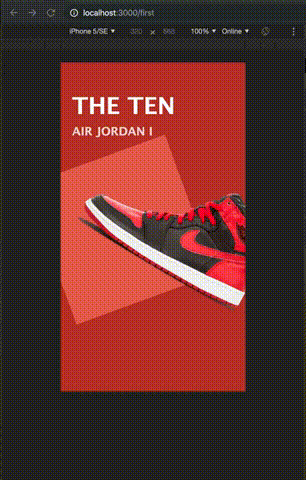
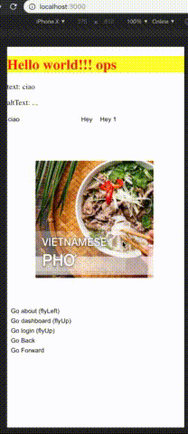

# Overview

## What is it?

React Animated Navigator is an extension for [**react-router**][1], 
which provides animated transitions between routes, with friendly components and hooks for navigation.
It is using [**react-transition-group**][2] to maintain the transitions.

  [1]: https://github.com/ReactTraining/react-router
  [2]: https://github.com/reactjs/react-transition-group

## Features

* Supports using focal element (aka `SharedElement`), which is a persistent element significant to the hierarchy that can be tweened. Like animated containers, focal elements enhance continuity by seamlessly transforming their appearance.

* Provides many built-in transitions (`Fly`, `Slide`, `Flip`, ... more effects will be added).

* Easy to use, and extend with your custom transitions.
